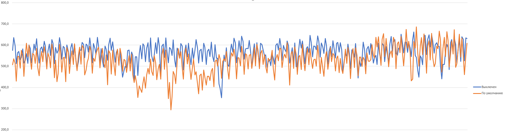

# Автовакуум
К сожалению, мне не удалось получить хоть какие-то результаты подверждающие эффективность настройки avtovacuum. Количество транзакций в секунду не отличалось между настройками по умолчанию и полностью выключенным autovacuum.  

Как видно по графику, пиковые и средние значения находятся примерно в одном диапазоне, а на всплески фактически влияют не сами настройки avtovacumm, а потребление ЦПУ остальной системой (или сторонними ВМ при нахождении в облаке).
# Теория
Теоретически, максимально стабильный TPS мы можем получить в том случае, когда нагрузка создаваемая процессами автовакуума наиболее постоянна. То есть процессы автовакуума работают с минимальными всплесками и практически непрерывно, затрагивая небольшой объем данных. Для достижения подобного результата должны быть установлены следующие параметры:  
1. **autovacuum_naptime** - параметр отвечающий за интервалы работы avtovacuum, после выполения автовакуума, следующий может быть запущен только через то кол-во секунд, которое указано в данном параметре.  
2. **autovacuum_vacuum_scale_factor** и **autovacuum_vacuum_threshold** - отвечают за то, какое количество записей должно быть изменено с прошлого процесса autovacuum для того, что бы он был выполнен вновь. 
3. **autovacuum_vacuum_insert_scale_factor** и **autovacuum_vacuum_insert_threshold**. Правтически то же самое, что и п.2, но считает только количество операций вставки в таблицу.
4. **autovacuum_analyze_scale_factor** и **autovacuum_analyze_threshold**. Почти как те же двое что перечислены выше, но отвечают за выполнения именно команды VACUUM ANALYZE, с помощью которой обновляется статистика по таблицам, что позволяеет строить более эффективные планы запроса, тем самым ускоряя их.

Итого, для получения наиболее постоянных значений TPS нам нужно уменьшать значения указанных выше параметров. К сожалению, получить практические результаты мне не удалось и показать какие-то конкретные значения я не могу.

# Заключение
Полностью синтетические тесты не способны помочь в установке оптимальных значений autovacuum, но способны в целом оценить производительность кластера (при переносе БД на HDD диск с SSD значение TPS падало с 700 до 17). Более точно подобрать параметры возможно либо написав свои скрипты тестирования, которые будут соответствовать профилю нагрузки при промышленной эксплуатации, либо в тестовой среде непосредственно с тем приложением, которое использует сервер СУБД. 